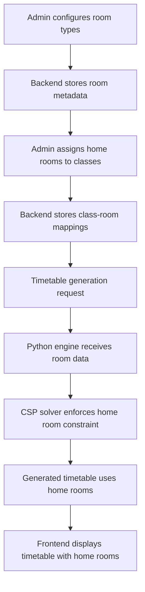

# Design Document: Class Home Room Assignment

## Overview

This feature implements a home room assignment system where each class is assigned a dedicated primary classroom for the entire academic year. This reflects real-world school operations where students have a consistent base location and only move to specialized facilities (labs, music rooms, etc.) when required by specific subjects.

The design integrates home room logic into the existing timetable generation system at multiple levels:
1. Data model extensions to support room types and home room assignments
2. CSP solver modifications to enforce home room constraints
3. API enhancements to configure and manage home room assignments

## Architecture

### System Context

The home room assignment feature integrates with:
- **Backend (NestJS)**: Manages room configuration, home room assignments, and API endpoints
- **Database (Prisma/SQLite)**: Stores room types, home room assignments, and subject requirements
- **Timetable Engine (Python)**: Enforces home room constraints during timetable generation
- **Frontend (Next.js)**: Provides UI for configuring room types and viewing home room assignments

### Data Flow



## Components and Interfaces

### 1. Database Schema Extensions

#### Room Model Enhancement
Add fields to the existing `Room` model to support room type classification:

```prisma
model Room {
  id       String   @id @default(cuid())
  schoolId String
  name     String
  capacity Int?
  type     String?  // EXISTING: "CLASSROOM", "LAB", "SPORTS", etc.
  isSpecialRoom Boolean @default(false)  // NEW: Marks if room is special-purpose
  specialRoomType String?  // NEW: "PHYSICS_LAB", "CHEMISTRY_LAB", "MUSIC_ROOM", etc.
  
  school   School   @relation(fields: [schoolId], references: [id])
  timetableEntries TimetableEntry[]
  homeRoomClasses  Class[]  // NEW: Classes that use this as home room
  
  @@map("rooms")
}
```

#### Class Model Enhancement
Add home room reference to the `Class` model:

```prisma
model Class {
  id          String           @id @default(cuid())
  schoolId    String
  name        String
  grade       Int
  section     String?
  stream      String?
  studentCount Int?
  homeRoomId  String?  // NEW: Reference to assigned home room
  
  school      School           @relation(fields: [schoolId], references: [id])
  homeRoom    Room?            @relation(fields: [homeRoomId], references: [id])  // NEW
  timetableEntries TimetableEntry[]
  
  @@map("classes")
}
```

#### Subject Model Enhancement
Add field to indicate if subject requires special room:

```prisma
model Subject {
  id              String   @id @default(cuid())
  schoolId        String
  name            String
  department      String?
  credits         Int
  minPeriodsPerWeek Int?
  maxPeriodsPerWeek Int?
  requiresLab     Boolean  @default(false)  // EXISTING
  requiredRoomType String?  // NEW: "PHYSICS_LAB", "MUSIC_ROOM", null for regular
  
  school          School   @relation(fields: [schoolId], references: [id])
  timetableEntries TimetableEntry[]
  gradeRequirements GradeSubjectRequirement[]
  
  @@map("subjects")
}
```

### 2. Backend API Enhancements

#### Room Management Endpoints

**Update Room Configuration**
```typescript
// PATCH /api/rooms/:id
interface UpdateRoomDto {
  name?: string;
  capacity?: number;
  type?: RoomType;
  isSpecialRoom?: boolean;
  specialRoomType?: string;
}
```

**Get Available Home Rooms**
```typescript
// GET /api/rooms/available-home-rooms
// Returns rooms that are not special rooms and not already assigned
interface AvailableHomeRoomsResponse {
  rooms: Room[];
}
```

#### Class Management Endpoints

**Assign Home Room to Class**
```typescript
// PATCH /api/classes/:id/home-room
interface AssignHomeRoomDto {
  homeRoomId: string;
}
```

**Get Class with Home Room**
```typescript
// GET /api/classes/:id
interface ClassWithHomeRoom {
  id: string;
  name: string;
  grade: number;
  section: string;
  homeRoom?: {
    id: string;
    name: string;
    capacity: number;
  };
}
```

### 3. Timetable Engine Integration

#### Python Model Extensions

Update `Room` model in `models_phase1_v25.py`:

```python
class Room(BaseModel):
    id: str
    school_id: str
    name: str
    building: Optional[str] = None
    floor: Optional[int] = None
    capacity: int
    type: RoomType = RoomType.CLASSROOM
    facilities: List[str] = []
    is_special_room: bool = False  # NEW
    special_room_type: Optional[str] = None  # NEW
```

Update `Class` model:

```python
class Class(BaseModel):
    id: str
    school_id: str
    name: str
    grade: int = Field(ge=1, le=12)
    section: str
    stream: Optional[Stream] = None
    student_count: Optional[int] = None
    home_room_id: Optional[str] = None  # NEW
```

Update `Subject` model:

```python
class Subject(BaseModel):
    id: str
    school_id: str
    name: str
    code: str
    periods_per_week: int = Field(ge=1, le=10)
    requires_lab: bool = False
    required_room_type: Optional[str] = None  # NEW
    is_elective: bool = False
    prefer_morning: bool = False
    preferred_periods: Optional[List[int]] = None
    avoid_periods: Optional[List[int]] = None
```

#### CSP Solver Modifications

Modify `CSPSolverCompleteV25` in `csp_solver_complete_v25.py`:

**New Method: Home Room Assignment Logic**
```python
def _assign_room_for_entry(
    self,
    class_obj: Class,
    subject: Subject,
    rooms: List[Room],
    slot: TimeSlot,
    room_busy: Dict
) -> Optional[Room]:
    """
    Assign appropriate room for a timetable entry.
    
    Priority:
    1. If subject requires special room, use that type
    2. Otherwise, use class's home room
    3. Fallback to any available room
    
    Args:
        class_obj: The class being scheduled
        subject: The subject being taught
        rooms: List of all available rooms
        slot: The time slot
        room_busy: Dictionary tracking room availability
        
    Returns:
        Assigned room or None if no room available
    """
    # Check if subject requires special room
    if subject.required_room_type:
        # Find available special room of required type
        for room in rooms:
            if (room.is_special_room and 
                room.special_room_type == subject.required_room_type and
                (room.id, slot.id) not in room_busy and
                room.capacity >= (class_obj.student_count or 30)):
                return room
        
        # No special room available - this is a constraint violation
        if self.debug:
            print(f"    [WARNING] No {subject.required_room_type} available for {subject.name}")
        return None
    
    # Use home room if assigned and available
    if class_obj.home_room_id:
        home_room = next((r for r in rooms if r.id == class_obj.home_room_id), None)
        if home_room and (home_room.id, slot.id) not in room_busy:
            return home_room
        
        # Home room is busy - this is a hard constraint violation
        if self.debug:
            print(f"    [ERROR] Home room {class_obj.home_room_id} busy for {class_obj.name}")
        return None
    
    # Fallback: Find any available non-special room
    for room in rooms:
        if (not room.is_special_room and
            (room.id, slot.id) not in room_busy and
            room.capacity >= (class_obj.student_count or 30)):
            return room
    
    return None
```

**Modify `_generate_complete_solution` method**:
Replace the existing room assignment logic with calls to `_assign_room_for_entry`:

```python
# OLD CODE (around line 450):
# Find available room
available_room = None
if subject.requires_lab:
    lab_rooms = [r for r in rooms if r.type == RoomType.LAB]
    for room in lab_rooms:
        if (room.id, slot.id) not in room_busy:
            available_room = room
            break

# NEW CODE:
available_room = self._assign_room_for_entry(
    class_obj, subject, rooms, slot, room_busy
)
```

**Add Validation Method**:
```python
def _validate_home_room_assignments(
    self,
    classes: List[Class],
    rooms: List[Room]
) -> Tuple[bool, List[str]]:
    """
    Validate that home room assignments are valid.
    
    Checks:
    1. Each class with home_room_id has a valid room
    2. Home rooms are not special rooms
    3. No two classes share the same home room
    4. Home room capacity is sufficient
    
    Returns:
        Tuple of (is_valid, list of error messages)
    """
    errors = []
    room_lookup = {r.id: r for r in rooms}
    assigned_home_rooms = set()
    
    for class_obj in classes:
        if not class_obj.home_room_id:
            continue
        
        # Check room exists
        if class_obj.home_room_id not in room_lookup:
            errors.append(
                f"Class {class_obj.name} assigned to non-existent room {class_obj.home_room_id}"
            )
            continue
        
        room = room_lookup[class_obj.home_room_id]
        
        # Check room is not special
        if room.is_special_room:
            errors.append(
                f"Class {class_obj.name} assigned to special room {room.name}"
            )
        
        # Check for duplicate assignments
        if room.id in assigned_home_rooms:
            errors.append(
                f"Room {room.name} assigned as home room to multiple classes"
            )
        assigned_home_rooms.add(room.id)
        
        # Check capacity
        if class_obj.student_count and room.capacity < class_obj.student_count:
            errors.append(
                f"Home room {room.name} capacity ({room.capacity}) insufficient for "
                f"class {class_obj.name} ({class_obj.student_count} students)"
            )
    
    return len(errors) == 0, errors
```

Call validation at the start of `solve` method:

```python
def solve(self, classes, subjects, teachers, time_slots, rooms, ...):
    start_time = time.time()
    
    # NEW: Validate home room assignments
    valid, errors = self._validate_home_room_assignments(classes, rooms)
    if not valid:
        return [], 0, errors, [
            "Fix home room assignments",
            "Ensure no special rooms are used as home rooms",
            "Ensure each home room is assigned to only one class"
        ]
    
    # ... rest of existing code
```

### 4. Frontend Components

#### Room Configuration UI

**Room Form Enhancement** (`frontend/components/forms/RoomForm.tsx`):
```typescript
interface RoomFormData {
  name: string;
  capacity: number;
  type: RoomType;
  isSpecialRoom: boolean;
  specialRoomType?: string;
}

// Add checkbox for "Is Special Room"
// Add dropdown for special room type (when checked)
```

#### Class Management UI

**Home Room Assignment** (`frontend/app/admin/classes/page.tsx`):
```typescript
// Add column to classes table showing home room
// Add "Assign Home Room" button/modal
// Show available home rooms (non-special, unassigned)
```

#### Timetable Display

**Home Room Indicator** (`frontend/components/timetable/TimetableGrid.tsx`):
```typescript
// Add visual indicator when a lesson is in home room vs special room
// Example: Home room lessons have normal background
//          Special room lessons have distinct color/icon
```

## Data Models

### Room Types Enum
```typescript
enum SpecialRoomType {
  PHYSICS_LAB = 'PHYSICS_LAB',
  CHEMISTRY_LAB = 'CHEMISTRY_LAB',
  BIOLOGY_LAB = 'BIOLOGY_LAB',
  COMPUTER_LAB = 'COMPUTER_LAB',
  MUSIC_ROOM = 'MUSIC_ROOM',
  ART_ROOM = 'ART_ROOM',
  SPORTS_HALL = 'SPORTS_HALL',
  LIBRARY = 'LIBRARY',
  AUDITORIUM = 'AUDITORIUM'
}
```

## Error Handling

### Validation Errors

1. **Home Room Assignment Conflicts**
   - Error: "Room {room_name} is already assigned as home room to {class_name}"
   - Resolution: Choose a different room or unassign from other class

2. **Special Room as Home Room**
   - Error: "Cannot assign special room {room_name} as home room"
   - Resolution: Select a regular classroom

3. **Capacity Mismatch**
   - Error: "Home room capacity ({capacity}) insufficient for class size ({student_count})"
   - Resolution: Choose larger room or reduce class size

4. **Missing Home Room During Generation**
   - Error: "Class {class_name} has no home room assigned"
   - Resolution: Assign home room before generating timetable

### Timetable Generation Errors

1. **Special Room Unavailable**
   - Error: "No {room_type} available for {subject_name} at {time}"
   - Suggestion: "Add more {room_type} rooms or reduce periods for subjects requiring them"

2. **Home Room Conflict**
   - Error: "Home room busy for {class_name} at {time}"
   - Suggestion: "This indicates a scheduling conflict - should not occur with proper CSP constraints"

## Testing Strategy

### Unit Tests

1. **Room Assignment Logic**
   - Test special room assignment for lab subjects
   - Test home room assignment for regular subjects
   - Test fallback when home room busy
   - Test validation of home room assignments

2. **Data Model Validation**
   - Test Prisma schema constraints
   - Test Pydantic model validation
   - Test API DTO validation

### Integration Tests

1. **API Endpoints**
   - Test room configuration updates
   - Test home room assignment to classes
   - Test retrieval of available home rooms
   - Test timetable generation with home rooms

2. **CSP Solver**
   - Test timetable generation with home room constraints
   - Test handling of special room requirements
   - Test error cases (no home room, special room conflicts)

### End-to-End Tests

1. **Complete Workflow**
   - Configure rooms (mark special rooms)
   - Assign home rooms to classes
   - Configure subjects with room requirements
   - Generate timetable
   - Verify home rooms used correctly
   - Verify special rooms used only when required

## Performance Considerations

### Database Queries
- Index on `Class.homeRoomId` for fast lookups
- Index on `Room.isSpecialRoom` for filtering
- Eager load home room data when fetching classes

### CSP Solver
- Pre-compute home room lookups before solving
- Cache room availability checks
- Early validation to fail fast on invalid configurations

### Caching
- Cache available home rooms list
- Cache room type configurations
- Invalidate cache on room/class updates

## Migration Strategy

### Phase 1: Database Schema
1. Add new fields to Prisma schema
2. Create migration
3. Run migration on development database
4. Verify data integrity

### Phase 2: Backend Implementation
1. Update DTOs and validation
2. Implement new API endpoints
3. Update existing endpoints to include home room data
4. Add unit tests

### Phase 3: Timetable Engine
1. Update Python models
2. Implement room assignment logic
3. Add validation methods
4. Update CSP solver
5. Add integration tests

### Phase 4: Frontend
1. Update room form
2. Add home room assignment UI
3. Update timetable display
4. Add visual indicators

### Phase 5: Data Migration
1. Script to assign default home rooms to existing classes
2. Mark existing special rooms (labs, etc.)
3. Validate all assignments

## Security Considerations

- Only admins can configure room types
- Only admins can assign home rooms
- Validate room ownership (school_id) on all operations
- Prevent assignment of rooms from different schools

## Monitoring and Observability

### Metrics
- Home room assignment coverage (% of classes with home rooms)
- Special room utilization rate
- Home room constraint violations during generation

### Logging
- Log home room assignments
- Log room type changes
- Log timetable generation with home room usage statistics

## Future Enhancements

1. **Automatic Home Room Assignment**
   - Algorithm to automatically assign optimal home rooms based on class size and room capacity

2. **Home Room Preferences**
   - Allow specifying preferred building/floor for classes
   - Consider proximity to special rooms

3. **Flexible Home Rooms**
   - Support multiple home rooms per class (e.g., different rooms for different days)
   - Support shared home rooms for small classes

4. **Room Booking System**
   - Allow temporary booking of special rooms
   - Handle conflicts and double-bookings
